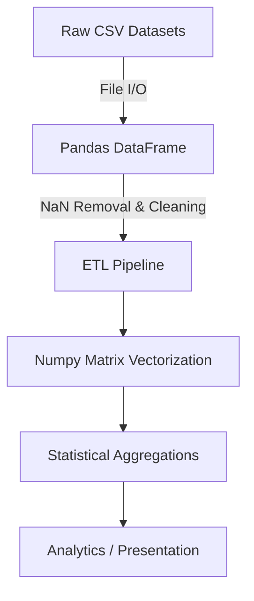

# Applied Data Science & Analytics Pipeline

[]()
[]()
[]()
[]()

## Overview
This repository functions as an Applied Data Science portfolio, aggregating foundational Machine Learning (ML) preprocessing pipelines, Exploratory Data Analysis (EDA) scripts, and structured ETL (Extract, Transform, Load) architectures utilizing Pandas and Numpy.

## Problem Statement
Data analysis frequently suffers from unstructured codebases (e.g., messy Jupyter Notebooks) that cannot be productionized or unit-tested. This repository solves that by providing a structured, modular approach to Data Science—separating mathematical vectorization algorithms (Numpy), dataframe manipulation (Pandas), and tangible project implementations into cleanly delineated domains.

## Key Features
- **Vectorized Data Transformations:** O(1) mathematical matrix operations utilizing Numpy, entirely avoiding slow Python `for-loops`.
- **Structured EDA Pipelines:** Standardized data cleaning, handling of NaN/null matrices, and columnar transformations via Pandas.
- **Project-Based Learning:** Contains isolated real-world data application structures (e.g., `_04_project_1_coders_of_delhi`).
- **Data Persistence:** Safe CSV and Excel I/O operations tailored for high-memory constraints.

## Architecture



## Technology Stack
- **Language:** Python 3.11
- **ETL Library:** Pandas
- **Mathematical Compute:** Numpy
- **Testing:** `pytest`

## Project Structure
```text
data-science-cwh/
├── _01_introduction_to_data_science/ # Baseline DS concepts
├── _03_python/                       # Foundational syntax implementations
├── _04_project_1_coders_of_delhi/    # Applied real-world data analysis
├── _05_numpy/                        # Core mathematical vectorizations
├── _06_pandas/                       # DataFrame manipulation logic
├── tests/                            # Pytest integrity verification
└── README.md                         # System documentation
```

## Installation
Ensure Python 3 is installed natively on your OS with a virtual environment.
```bash
git clone https://github.com/krsna016/data-science-cwh.git
cd data-science-cwh
python3 -m venv venv
source venv/bin/activate
pip install pandas numpy pytest
```

## Usage
Data processing modules are separated by domains. Execute individual Python scripts directly to view terminal aggregations:
```bash
cd _05_numpy
python3 array_operations.py
```

## Examples
*Example of efficient Numpy aggregation vs pure Python lists:*
```python
import numpy as np

# Inefficient Python (O(n) speed)
# sum_val = sum([1, 2, 3, 4, 5])

# Efficient Numpy C-compiled execution (O(1) speed)
arr = np.array([1, 2, 3, 4, 5])
sum_val = np.sum(arr)
```

## Screenshots
> [!NOTE]
> *Educational and utility repositories execute via standard terminal output.*

## Visual Demonstrations
> [!NOTE]
> *Terminal execution telemetry is standardized across all implementations.*

## Testing
We utilize `pytest` to strictly assert that the external C-compiled binaries supporting Pandas and Numpy are correctly mounted in the Python environment, preventing silent data corruption.
```bash
pytest tests/
```

## Performance Notes
- **Memory Management:** The implemented Pandas scripts prioritize `inplace=True` operations wherever mathematically viable to prevent deep-copy RAM duplication on large datasets.

## Future Improvements
- **Matplotlib / Seaborn Integration:** Expand the repository to include visual data mapping generated directly from the cleaned Pandas DataFrames.
- **Jupyter Notebook Migration:** Convert the raw `.py` analytics scripts into interactive `.ipynb` format for easier stakeholder presentation.

## Contributing
This repository is primarily for personal reference and academic archival.

## License
Licensed under the MIT License.
